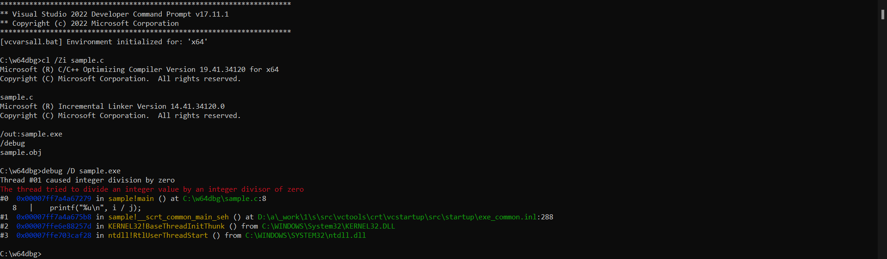
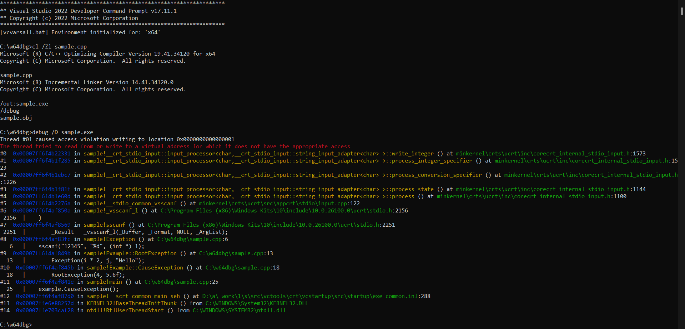

# w64dbg

## About

w64dbg is a tool debugging live user-mode and kernel-mode code for 64-bit Windows OS and dumping out stack frame. It can read PDB format itself and read _DWARF_ format generated by GNU C/C++ Compiler in backend.

## Download

* [Releases](https://github.com/CyberPhoenixArchitecture/w64dbg/releases)

* [Git repository](https://github.com/CyberPhoenixArchitecture/w64dbg)

## Installation

After download build binaries, you should run **setup.bat** to ensure working environment is fine.

## Usage

    
    Usage: debug [/D] [/G] [/Q] [/S] executable [...]
    
    Description:
    This tool is used to debug an executable on 64-bit Windows OS.
    
    Parameter List:
    /D Load debug symbols.
    /G Load debug symbols in DWARF format.
    /Q Do not display verbose information.
    /S Start executable with a new console.
    

## Sample

## DLL Dependency

|                  DLL                  |      Location       |               Package                |
| ------------------------------------- | ------------------- | ------------------------------------ |
| dbghelp.dll                           | C:\Windows\System32 | Debugging Tools For Windows          |
| KERNEL32.dll                          | C:\Windows\System32 | Microsoft Visual C++ Redistributable |
| api-ms-win-crt-convert-l1-1-0.dll     | C:\Windows\System32 | Microsoft Visual C++ Redistributable |
| api-ms-win-crt-environment-l1-1-0.dll | C:\Windows\System32 | Microsoft Visual C++ Redistributable |
| api-ms-win-crt-heap-l1-1-0.dll        | C:\Windows\System32 | Microsoft Visual C++ Redistributable |
| api-ms-win-crt-math-l1-1-0.dll        | C:\Windows\System32 | Microsoft Visual C++ Redistributable |
| api-ms-win-crt-private-l1-1-0.dll     | C:\Windows\System32 | Microsoft Visual C++ Redistributable |
| api-ms-win-crt-runtime-l1-1-0.dll     | C:\Windows\System32 | Microsoft Visual C++ Redistributable |
| api-ms-win-crt-stdio-l1-1-0.dll       | C:\Windows\System32 | Microsoft Visual C++ Redistributable |
| api-ms-win-crt-string-l1-1-0.dll      | C:\Windows\System32 | Microsoft Visual C++ Redistributable |
| api-ms-win-crt-time-l1-1-0.dll        | C:\Windows\System32 | Microsoft Visual C++ Redistributable |

## Requirements

Minium supported OS: Windows Vista

Processor architecture: x64

## Frequently Asked Questions

### How can I get errno value of a specific thread?

Currently there is no way to get **errno** value as it's not a variable. It's definition is:

    
    _CRTIMP extern int *__cdecl _errno(void);
    #define errno (*_errno())
    

References to errno actually call the internal **_errno()** function, which returns the error value for the caller thread.

### Which options should I pass to MSVC when compiling?

* **`/DEBUG`** : generate debug information

See [this](https://learn.microsoft.com/en-us/cpp/build/reference/debug-generate-debug-info) for more details.

### Which options should I pass to GCC/Clang when compiling?

* **`-g`** : generate debug information

See [this](https://gcc.gnu.org/onlinedocs/gcc/Debugging-Options.html#index-g) for more details.

* **`-fno-omit-frame-pointer`** : Do not omit the frame pointer in functions that don’t need one

See [this](https://gcc.gnu.org/onlinedocs/gcc/Optimize-Options.html#index-fomit-frame-pointer) for more details.

## License

w64dbg is licensed under the BSD-3-Clause license.

See [LICENSE](LICENSE) for more details.
